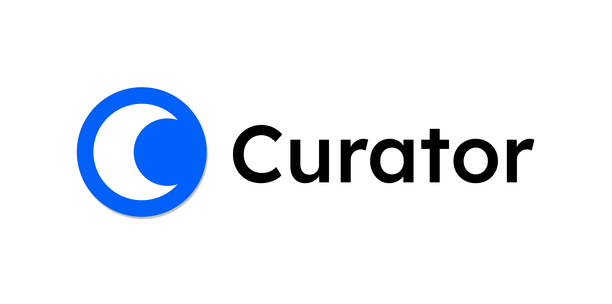

# Curator

<p align="center">
   
</p>

<p align="center">
  <a href="https://opensource.org/license/apache-2-0">
    
  </a>
</p>

<p align="center">
  <a href="https://curator.com.br">
    
  </a>
  &nbsp;
  <a href="https://docs.curator.com.br"> 
    
  </a>
</p>

---

## 🎯 About the Project

(Seu conteúdo começa aqui...)

Welcome to the **Curator** platform monorepo. This repository contains all applications, services, and infrastructure code for the Curator project.

Our mission is to combat shallow, low-context content by providing "Lifelong Learners" with curated, in-depth learning journeys. We act as a "sommelier of culture," guiding users through the best books, films, albums, and articles on any given topic in a logical, meaningful sequence.

This project is built on a foundation of **Domain-Driven Design (DDD)**, **Microservices**, **100% Infrastructure as Code (IaC)**, and **Event-Driven Architecture**.

---

## 🚀 Getting Started (Developer Golden Path)

This monorepo is managed using **pnpm** and **Turborepo**.

### 1. Prerequisites

Before you begin, ensure you have the following tools installed:

- **pnpm:** (v8 or higher)
- **Node.js:** (v20 or higher)
- **Terraform:** (v1.5 or higher)
- **AWS CLI:** (v2)

### 2. Installation

Clone the repository and install all dependencies using `pnpm`:

```bash
# Clone the repository
git clone [https://github.com/thiagofons/curator.git](https://github.com/thiagofons/curator.git)
cd curator

# Install all dependencies across all apps and packages
pnpm install
```

## 🛠️ Technology Stack (By Domain)

This section outlines the core technologies used across the Curator Platform, categorized by their engineering domain.

### 1. Documentation

| Status | Technology                 | Purpose                                                 |
| :----- | :------------------------- | :------------------------------------------------------ |
| ✅     | Storybook                  | UI components documentation.                            |
| ⌛     | OpenAPI                    | Provides a formal standard for describing HTTP APIs.    |
| ⌛     | Swagger UI                 | Visualization and interaction with the API’s resources. |
| ✅     | Nextra (Next.js)           | Powers the static documentation portal.                 |
| ✅     | Mermaid.js (Diagrams)      | Renders text-based architecture diagrams.               |
| ⌛     | TypeDoc (TSDoc Generation) | Generates API reference from code comments.             |
| ✅     | Astro                      | Blogging framework.                                     |
| ⌛     | Sandpack (Live Sandboxes)  | Embeds live, editable code examples.                    |

### 2. Observability

| Status | Technology              | Purpose                                       |
| :----- | :---------------------- | :-------------------------------------------- |
| ✅     | OpenTelemetry (Tracing) | Provides distributed tracing for requests.    |
| ✅     | Grafana (Dashboards)    | Visualizes metrics and logs in dashboards.    |
| ✅     | Prometheus (Metrics)    | Collects time-series metrics from services.   |
| ✅     | Loki (Logs)             | Aggregates log streams from all applications. |

### 3. Architecture

| Status | Technology                      | Purpose                                        |
| :----- | :------------------------------ | :--------------------------------------------- |
| ✅     | Domain-Driven Design (DDD)      | Models the software to match business domains. |
| ⌛     | Microservices                   | Decouples services by business capability.     |
| ⌛     | Event-Driven Architecture (EDA) | Models the communication between the services. |
| ✅     | RabbitMQ                        | Asynchrounous Message Broker.                  |
| ⌛     | GraphQL                         | Query language for APIs.                       |
| ✅     | tRPC (Typesafe API)             | Enables end-to-end typesafe APIs.              |

### 4. Front-End & UX

| Status | Technology  | Purpose                                                          |
| :----- | :---------- | :--------------------------------------------------------------- |
| ✅     | React 19    | Builds the user interface components.                            |
| ✅     | Next.js 15  | Powers the server-side rendered web application.                 |
| ⌛     | Zustand     | A small, fast, and scalable bearbones state management solution. |
| ✅     | TailwindCSS | Provides a utility-first CSS framework.                          |
| ✅     | ShadcnUI    | Beautifully designed customizable components.                    |
| ⌛     | CDN         | Global distribution of content.                                  |
| ⌛     | i18n        | Provides internationalization.                                   |

### 5. Data Platform

| Status | Technology      | Purpose                                      |
| :----- | :-------------- | :------------------------------------------- |
| ✅     | PostgreSQL      | Serves as the primary relational database.   |
| ⌛     | ScyllaDB        | Large-scale noSQL.                           |
| ✅     | Redis           | Real-time and cache.                         |
| ⌛     | Clickhouse      | Analytics.                                   |
| ✅     | Prisma (ORM)    | Provides a typesafe database client and ORM. |
| ⌛     | Data Build Tool | Data orchstration and analytics              |

### 6. Infrastructure, DevOps & SRE

| Status | Technology                   | Purpose                                           |
| :----- | :--------------------------- | :------------------------------------------------ |
| ✅     | AWS (Cloud Provider)         | The primary cloud provider for all services.      |
| ✅     | Docker                       | Containerizes applications for deployment.        |
| ⌛     | Kubernetes (EKS)             | Orchestrates production backend containers.       |
| ⌛     | Linkerd                      | Smart network layer on top of Kubernetes.         |
| ✅     | Terraform (IaC)              | Defines and manages infrastructure as code.       |
| ⌛     | Terragrunt (IaC)             | Apply an orchestration layer to keep IaC DRY.     |
| ✅     | Vercel (Static Site Hosting) | Provides managed hosting for the static frontend. |

### 7. Security (DevSecOps)

| Status | Technology                | Purpose                                                |
| :----- | :------------------------ | :----------------------------------------------------- |
| ⌛     | SonarQube                 | Searches bugs, vulnerabilities and "code smells" in CI |
| ✅     | GitHub Dependabot         | Continually scans our dependencies.                    |
| ⌛     | Trivy                     | Container image analysis.                              |
| ✅     | AWS Secrets Manager       | Securely stores and injects secrets.                   |
| ⌛     | AWS WAF                   | Web Application Firewall                               |
| ✅     | AWS IAM (Permissions)     | Manages granular permissions for AWS services.         |
| ⌛     | Auth0 (Identity Provider) | Manages user authentication and identity.              |

### 8. Quality & Testing

| Status | Technology              | Purpose                     |
| :----- | :---------------------- | :-------------------------- |
| ✅     | Prettier + ESLint       | Static code analysis.       |
| ✅     | Vitest                  | Unit tests.                 |
| ⌛     | Prisma Test Environment | Integration tests.          |
| ✅     | Playwright              | E2E tests.                  |
| ⌛     | Stryker                 | Quality tests.              |
| ⌛     | Pact                    | Contract tests.             |
| ⌛     | k6                      | Load and performance tests. |

### 9. Developer Experience (DX)

| Status | Technology        | Purpose                                 |
| :----- | :---------------- | :-------------------------------------- |
| ✅     | Turborepo         | Orchestrates and caches monorepo tasks. |
| ⌛     | GitHub Codespaces | Remote development environment.         |
| ✅     | Husky             | Commit pipeline.                        |
| ⌛     | FlagSmith         | Feature flags.                          |

### 10. CI/CD

| Status | Technology                      | Purpose                              |
| :----- | :------------------------------ | :----------------------------------- |
| ✅     | GitHub Actions                  | Automates the CI/CD pipeline.        |
| ⌛     | Turborepo Remote Cache (AWS S3) | Provides a shared build cache on S3. |
