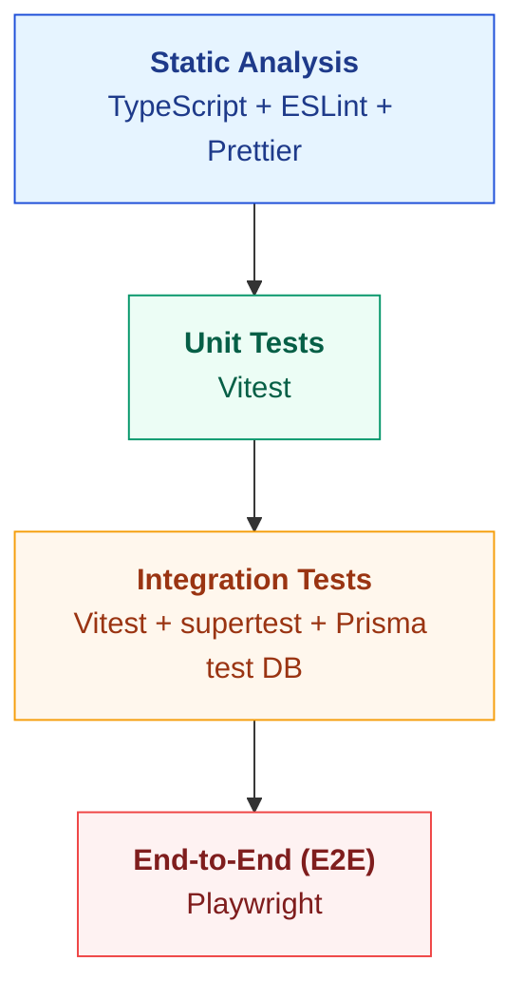

---
# Nextra frontmatter metadata (optional, for sidebar index)
title: "003 - Testing Trophy"
---

# 📝 Architecture Decision Record (ADR)

## 003 - Testing Trophy

|                | Value         |
| :------------- | :------------ |
| **Status**     | ✅ Accepted   |
| **Date**       | 2025-11-09    |
| **Decider(s)** | Thiago Arruda |

---

## 1. Context

We need a clear, consistent, and efficient testing strategy that provides fast feedback without sacrificing reliability where it matters most: critical flows between API/event handlers and the database. Our context involves multiple services and a modern frontend, with CI pipelines and a development environment optimized for quick iterations. Without guidance, tests tend to become slow, brittle (especially with excessive E2E), or detached from real behavior (over-mocking), reducing confidence in releases.

Driving forces:

- Fast feedback during edit/commit (strong DX productivity).
- High confidence in domain behavior and real database integration.
- Lean and reliable E2E for critical user journeys.
- Tooling standardized with our stack (TypeScript, ESLint, Prettier, Prisma, Playwright).

## 2. Decision

We will adopt the Testing Trophy strategy, emphasizing integration value and fast feedback at the base. The layers and tools are:

#### 1. Static Analysis (The Base): TypeScript, ESLint & Prettier

- Goal: Catch all type errors, formatting issues, and linting violations at edit/compile time — our first and fastest feedback loop.
- Tools: `tsc` (TypeScript compiler), `ESLint` (for linting), and `Prettier` (for formatting).

#### 2. Unit Tests (The Smallest Value): Vitest

- Goal: Test pure, isolated business logic (e.g., complex calculations in a Domain Entity) and utility functions. Avoid heavy mocking; if a test needs a database, it becomes an Integration Test.
- Tools: `Vitest` (with in-memory mocks if absolutely necessary).

#### 3. Integration Tests (The Core Value): Vitest + Prisma Test Environment

- Goal: Our most important layer. Validate a single microservice’s flow from API/event handler down to the real database, covering repositories/queries and consistency rules.
- Tools: `Vitest` + `supertest` (for API) + Prisma’s isolated test database environment (dedicated test DB per run with migrations/seed).

#### 4. End-to-End (E2E) Tests (The Top): Playwright

- Goal: Validate critical, cross-domain user journeys by simulating a real user in a real browser.
- Tools: `Playwright` running against a full, like-production environment (real services, consistent seed, predictable data).

#### Complementary policies:

- Prefer Integration over complex mocks when behavior depends on real I/O (DB/HTTP).
- Keep the E2E suite small and high value (smoke + critical journeys).
- Make static analysis mandatory on commit/CI; use Unit/Integration tests as PR gates; run E2E in release/smoke pipelines.

### Diagram

## 3. Consequences

### ➕ Positive Consequences (Gains)

- Very fast feedback via TypeScript + ESLint (catches trivial issues before running tests).
- Higher confidence in service behavior by prioritizing Integration tests with a real database.
- Fast and cheap Unit tests for pure logic (isolation and clarity).
- More stable and cheaper-to-maintain E2E by focusing only on what is critical.
- Stack coherence with our ecosystem (ESLint, Prettier, Prisma, Playwright) and strong DX.

### ➖ Negative Consequences (Costs/Risks)

- Higher CI operational complexity to orchestrate an isolated test DB, migrations, and seed.
- Additional execution time for Integration versus Unit; requires parallelization/caching.
- Ongoing maintenance of consistent fixtures/test data for Integration/E2E.
- Flakiness risk in E2E if the like-production environment is not deterministic.
- Configuration complexity: Managing separate configs for ESLint and Prettier (and their conflicts) across a monorepo.

---

## 4. Alternatives Considered

### Alternative A: Testing Pyramid (heavy unit focus)

- Description: Predominant focus on Unit tests, few Integration tests, and rare E2E.
- Reason for Rejection: In data-driven microservices, the risk of divergence between mocks and real behavior is high. Confidence is lost where it matters most: database integration and the transport layer.

### Alternative B: E2E-first / E2E-only

- Description: Cover most cases via end-to-end tests.
- Reason for Rejection: High cost, slow, and brittle. It hampers fast feedback and makes failure diagnosis more expensive.

### Alternative C: ESLint + Prettier instead of Biome

- Description: Use the all-in-one, high-performance tool BiomeJS for linting and formatting.
- Reason for Rejection: While Biome is extremely fast and simplifies configuration, the ecosystem for ESLint + Prettier is significantly more mature. Our stack (e.g., specific plugins for tRPC, Next.js, or monorepo pathing) is better supported by the vast ESLint plugin ecosystem. We prioritize maturity and ecosystem support over raw performance for this project.

### Alternative D: Jest instead of Vitest

- Description: A well-established test runner with a broad ecosystem.
- Reason for Rejection: Vitest integrates better with Vite, is faster in our context, and meets our needs (including mocks when necessary).

---

## 5. Related Links
