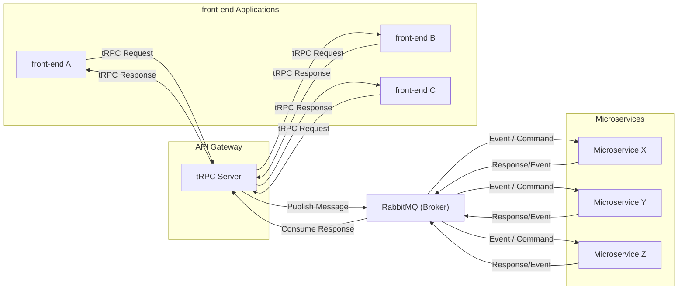

# 📝 Architecture Decision Record (ADR)

## 004 - tRPC for Front-End to API Gateway Communication

|                | Value         |
| :------------- | :------------ |
| **Status**     | ✅ Accepted   |
| **Date**       | 2025-11-16    |
| **Decider(s)** | Thiago Arruda |

---

## 1. Context

Our ecosystem consists of multiple microservices exposed via an API Gateway. The front-end needs to consume data and trigger actions on the Gateway efficiently and safely.

The technical challenge is ensuring that data contracts (schemas, payloads) between the client and server are perfectly synchronized. In our end-to-end TypeScript stack, the traditional approach (REST + OpenAPI) requires a "code generation" step (e.g., `openapi-generator`) to create types for the front-end.

This step is fragile, breaks our **Developer Experience (DX) **pillar (the "Golden Path"), and can easily lead to runtime errors if the generated client and the real API diverge, impacting the **Quality** pillar. We want the TypeScript compiler to be our primary integration guarantee.

## 2. Decision

We have decided to adopt **tRPC** to manage the communication between our front-end (Next.js) and our API Gateway.

tRPC allows us to define and consume APIs with **full end-to-end type safety** with automatic router generation, using nestjs-trpc. Because we operate in a Monorepo (a core DX pillar), the front-end can import the API's "types" directly from the back-end's source code.

The API Gateway will expose a tRPC "router," and the Next.js client will consume its "procedures" as if they were local function calls, complete with VS Code autocomplete and compile-time type checking.

Above you can see a full diagram of the data flow:

## 3. Consequences

### ➕ Positive Consequences (Gains)

- **Full Type Safety:** The primary benefit. Integration errors (e.g., sending a malformed payload to create a `Roadmap`) are caught at compile-time, not runtime.
- **Exponential Developer Experience (DX):** The "Golden Path" is clear. The front-end developer gets autocomplete for back-end routes and schemas. Back-end refactors will break the front-end's build (which is excellent), forcing updates.
- **Performance (Request Batching):** tRPC natively supports batching multiple procedure calls into a single HTTP request, which can reduce network latency.

### ➖ Negative Consequences (Costs/Risks)

- **Coupling to the TypeScript Stack:** tRPC's magic only works because the client and server are both TypeScript. This is not an issue for us, as it's our defined stack, but it prevents us from using a "generic" non-TS client.
- **Not a Standard for Public APIs:** tRPC is not a replacement for REST or GraphQL for public-facing APIs (e.g., if we exposed our API to partners). This decision only applies to the internal communication between our own front-end and our Gateway.

---

## 4. Alternatives Considered

### Alternative A: REST + OpenAPI Client Generation

- Description: The API Gateway would expose a `swagger.json` (Documentation pillar). The front-end would use a tool (e.g., `openapi-typescript`) in the CI/CD pipeline to generate types and an SDK.
- Reason for Rejection: Violates the **DX** pillar. It introduces an extra, fragile step in development that can fail or become desynchronized. The "source of truth" (the code) and the contract (OpenAPI) can diverge, leading to runtime errors that tRPC avoids.

### Alternative B: GraphQL

- Description: Use a GraphQL Gateway (e.g., Apollo Federation), allowing the front-end to request exactly the data it needs.
- Reason for Rejection: Significantly higher complexity for our MVP. GraphQL brings its own challenges (N+1 query patterns, complex caching, steeper learning curve). tRPC gives us 90% of GraphQL's type-safety benefits with 10% of the implementation cost.

### Alternative C: gRPC-Web

- Description: Use gRPC (which we are considering for internal service-to-service communication) all the way to the browser.
- Reason for Rejection: Requires a complex proxy layer (e.g., Envoy) to translate gRPC-Web (browser) to native gRPC (services). Protobuf-to-TypeScript type integration is not as fluid or native as tRPC's (which can use Zod or pure TS interfaces).

---

## 5. Related Links

[tRPC Official Documentation](https://trpc.io/)
