# 👩‍💻 Developer Workflow

This document outlines the "Golden Path" for all developers contributing to the Curator platform. Following this workflow ensures our codebase remains high-quality, consistent, and stable.

Our workflow is designed around four main quality gates:

1.  **Pre-Commit:** Automated local checks.
2.  **Pre-Push:** Automated local testing.
3.  **Pull Request (CI):** Full-scale automated testing.
4.  **Pull Request (Review):** Peer review.

## The Full Workflow (Map)

This diagram shows the complete "idea-to-merge" lifecycle.

```mermaid
graph TD
  A[Start: New Issue] --> B(Create Branch);
  B --> C{Write Code};
  C --> D[git commit];
  D -- Hook --> E[<b>Gate 1: Pre-Commit</b><br/>Run Lint & Format];
  E -- Fails --> C;
  E -- Pass --> F[git push];
  F -- Hook --> G[<b>Gate 2: Pre-Push</b><br/>Run Unit Tests];
  G -- Fails --> C;
  G -- Pass --> H[Open Pull Request];
  H -- CI --> I[<b>Gate 3: CI Pipeline</b><br/>Run Build, Unit, Integration, & E2E Tests];
  H -- Review --> J[<b>Gate 4: Peer Review</b><br/>Team Approves];
  I -- Fails --> C;
  J -- Changes? --> C;
  I & J -- Pass --> K[Squash & Merge to 'main'];
  K --> L[Done! 🚀];

  classDef gates fill:#fef2f2,stroke:#ef4444,color:#b91c1c;
  class E,G,I,J gates;
```



---

## 1. Branching Model (Simplified Gitflow)

All work must be done on a feature branch. The `main` branch is protected and cannot be pushed to directly.

Your branch name should follow this convention:
`type/scope/description`

- **`type`**: `feat`, `fix`, `chore`, `docs`, `refactor`
- **`scope`**: (Optional) The app or package (e.g., `api`, `ui-web`)
- **`description`**: A short `kebab-case` description.

**Good Branch Names:**

- `feat/api/add-roadmap-creation`
- `fix/ui-web/button-style`
- `docs/workflow-page`
- `chore/update-deps`

---

## 2. Gate 1: The Commit Loop (Pre-Commit)

**When it runs:** Every time you run `git commit -m "..."`.

**What it does:**
This hook is **instant** (sub-second). It uses `lint-staged` to run the following tasks **only** on the files you have staged (`git add`):

1.  **Format (`prettier --write`):** Automatically re-formats your code (e.g., fixes spacing, adds/removes semicolons).
2.  **Lint (`eslint --fix`):** Automatically fixes simple linting errors (e.g., import order).

This hook exists to **help you** by fixing formatting for you. It's normal for your commit to automatically include new formatting changes.

**Why it fails:**
Your commit will be **ABORTED** if the linter finds a serious error that it cannot fix automatically (e.g., you have a `console.log` statement).

**What to do:**

1.  Read the error message from ESLint in your terminal.
2.  Fix the error in your code.
3.  `git add` the fixed file.
4.  Try to commit again.

---

## 3. Gate 2: The Push Loop (Pre-Push)

**When it runs:** Every time you run `git push`.

**What it does:**
This hook is slower. It ensures you don't push broken code to the repository. It runs:

1.  **Unit Tests (`pnpm test:unit`):** Runs all unit tests across the monorepo, orchestrated by Turborepo. (We only run unit tests here because integration tests are too slow for a hook).

**Why it fails:**
Your push will be **ABORTED** if any unit test fails.

**What to do:**

1.  Read the test failure output from Vitest.
2.  Run `pnpm test:unit` (or `pnpm test:unit --filter=<your-package>`) locally to debug.
3.  Fix the broken test.
4.  Commit your fix, then try to `git push` again.

> **The "Emergency Hatch" (Bypass)**
>
> If you are in an absolute emergency, you can bypass these hooks using the `--no-verify` flag.
>
> ```bash
> # Bypasses the pre-commit hook
> git commit -m "my commit" --no-verify
>
> # Bypasses the pre-push hook
> git push --no-verify
> ```
>
> **Warning:** Use this at your own risk. You are taking responsibility for any linting errors or broken tests that you push to the CI.

---

## 4. Gate 3 & 4: The Pull Request (CI & Review)

Once your code is pushed, open a Pull Request (PR) on GitHub. This kicks off the two most important quality gates.

### Gate 3: CI (GitHub Actions)

Our CI pipeline runs automatically on every PR. It is the single source of truth for code health. It runs:

- `pnpm run build`
- `pnpm run lint`
- `pnpm run format:check`
- `pnpm run test:unit`
- `pnpm run test:it` (All Integration Tests)
- `pnpm run test:e2e` (All End-to-End Tests)
- `pnpm run storybook:build`

**A "green" CI is mandatory for merging.**

### Gate 4: Peer Review

- Use the **Pull Request Template** to describe what you did and why (this should link to the original Issue).
- Request a review from at least one other team member.
- The reviewer will check for architectural soundness, correct logic, and adherence to our ADRs.

---

## 5. Merging

Once your PR has (1) passed CI and (2) been approved by a peer, you can merge it.

**Always use "Squash and Merge".**

This keeps our `main` branch history clean. Each commit on `main` represents one complete, reviewed, and tested feature.
